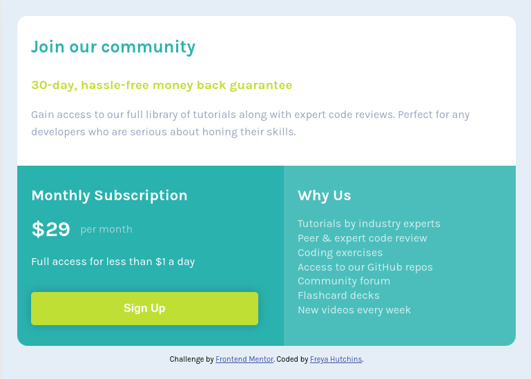

# Frontend Mentor - Single price grid component solution

This is a solution to the [Single price grid component challenge on Frontend Mentor](https://www.frontendmentor.io/challenges/single-price-grid-component-5ce41129d0ff452fec5abbbc). Frontend Mentor challenges help you improve your coding skills by building realistic projects. 

## Table of contents

- [Overview](#overview)
  - [The challenge](#the-challenge)
  - [Screenshot](#screenshot)
  - [Links](#links)
- [My process](#my-process)
  - [Built with](#built-with)
  - [What I learned](#what-i-learned)
  - [Continued development](#continued-development)
  - [Useful resources](#useful-resources)
- [Author](#author)

**Note: Delete this note and update the table of contents based on what sections you keep.**

## Overview

### The challenge

Users should be able to:

- View the optimal layout for the component depending on their device's screen size
- See a hover state on desktop for the Sign Up call-to-action

### Screenshot




Above is my solution to the challenge. The design is responsive and was made via a mobile-first approach. 

### Links

- Solution URL: [Add solution URL here](https://your-solution-url.com)
- Live Site URL: [Add live site URL here](https://your-live-site-url.com)

## My process

### Built with

- Semantic HTML5 markup
- CSS custom properties
- CSS Grid
- Mobile-first workflow

### What I learned

I used this challenge to learn more about implementing CSS Grid and to gain a better understanding of how it works. 
I feel that this is an important skill to learn and understand rather than 100% relying on solutions such as Bootstrap5 Grid.

```css
.grid-container {
  display: grid;
  grid-template-areas:
    'header header header header header header'
    'left left left right right right';
  gap: 0;
}
```

```css
@media (max-width: 530px) {
  .grid-container {
    grid-template-areas:
        'header header header header header header'
        'left left left left left left'
        'right right right right right right'
  }
}
```

### Continued development

Use this section to outline areas that you want to continue focusing on in future projects. These could be concepts you're still not completely comfortable with or techniques you found useful that you want to refine and perfect.

### Useful resources

- [W3Schools CSS Grid](https://www.w3schools.com/css/css_grid.asp) - This broke down how to use Grid in an easy-to-understand way.
- [Stack Overflow](https://stackoverflow.com/a/17777874) - I wasn't 100% sure how to implement in-line display for the external CSS stylesheet. This answer I found on Stack Overflow was really helpful.


## Author

- Website - [Add your name here](https://www.your-site.com)
- Frontend Mentor - [@yourusername](https://www.frontendmentor.io/profile/yourusername)